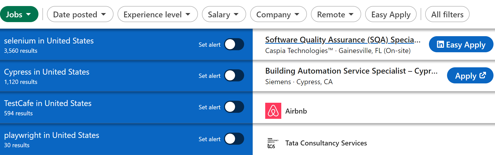
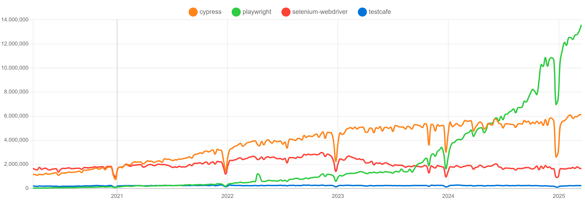

# Today's Web Test Automation — Houston, We've Got a Problem

Let's take a look at the four main frameworks dominating the test automation market today and try to spot a problem: **Selenium** (launched in 2004), **TestCafe** (launched in 2012), **Cypress** (launched in 2018), and **Playwright** (launched in 2020). These are the top independent tools. There are many Selenium-based frameworks, like **Protractor**, **Katalon**, **Robot Framework**, and others, but they all inherit most (if not all) of Selenium’s pros and cons.

Selenium has been the default go-to automation tool for almost two decades. Even today, the number of open jobs in the US, currently posted on LinkedIn, overwhelmingly favors Selenium: **3560 jobs require Selenium**, **1120 need Cypress**, **594 need TestCafe**, and **only 30 mention Playwright**:  

While NPM package statistics show that both Cypress and Playwright have surpassed Selenium in downloads (4 and 1 year ago, respectively), this doesn’t reflect the actual usage picture, as **JavaScript is not the dominant language** for Selenium-based frameworks:

This disparity is clearly reflected in the job market statistics mentioned above.

So, if Selenium has been on the market for so long, has the biggest professional community around it, and is so popular in the job market — doesn't all that objectively indicate that it is the best tool for automating web application testing?  

**Nope. And here's why.**

Any QA engineer who has written test automation with Selenium for at least **6-12 months** knows all the main flaws of this tool. First of all, it is not really a framework — it’s more of a library. To visualize the difference, imagine a shop (woodworking, auto-repair, or any other): every tool has its own place and purpose, every power tool is plugged in and ready to do the job, every workbench is set up for a streamlined process — everything is organized to start working in minutes, in the most effective way, depending on the task. **Selenium** is the same set of tools, but all are still in their boxes in a shipping container, delivered to the doors of your empty shop — it is now up to you to unpack and set everything up to a usable condition. Doing that efficiently is almost an impossible task if you've never done it before.

Modern frameworks like **Cypress** and **Playwright** are the opposite — first meaningful tests can be written in **minutes** from the framework download, not in hours. Of course, if you want to do it right from the beginning (which you should), you’d start with proper framework architecture first: layout your **page object model**, implement **test environment setup**, and all the other typical things for commercial applications. Building such a structure with Selenium feels like getting a new piece of furniture from a DIY store — you’ve got all the parts and the instructions, but instead of just assembling it, you first have to **chop down the tree**, **process the wood**, and **manufacture every bolt and screw**. In contrast, modern frameworks like Cypress and Playwright are like getting a **ready-to-assemble kit** with everything prepped — you just need to put it together.

So yes, Houston, we have a big problem here: the job market promotes knowledge of **outdated tools**, which are far from the best solution for the task, and therefore slows down the entire industry and **undermines technological progress**, while modern test automation is evolving at a rapid pace.

I encourage you to share your thoughts and experiences in the comments — what challenges have you faced, and what tools have you found most effective?

Stay tuned for upcoming articles, where we’ll dive deeper into the specifics of modern test automation practices, best tools, and strategies. And who knows, maybe together, we can even craft a new **Test Automation Manifesto**. After all, the last one was written over 20 years ago, and it’s long overdue for an update.
