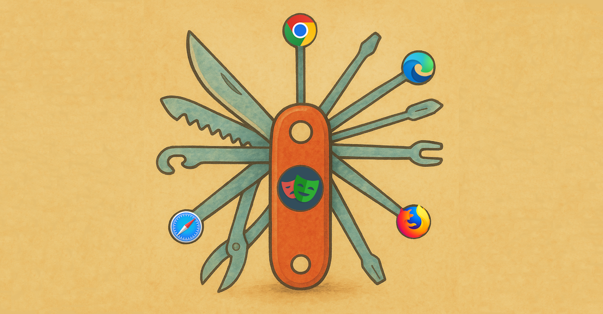

# Browser Support — Everything Everywhere All at Once

Playwright transforms browser testing with its built-in browser management, ditching the need for external WebDriver binaries that plague **Selenium**. It supports **Chromium** (including **Google Chrome**, **Microsoft Edge**, and **Opera**), **Firefox**, and **WebKit** (Safari’s engine), making it a powerhouse for cross-platform testing — even on iOS devices. Unlike **Cypress**, which skips WebKit support, Playwright ensures your app shines everywhere.

Its strength? Full access to browser APIs, letting you:

- Observe, log, intercept, mock, and trace **UI elements**, **console logs**, and **network traffic**.
- Monitor API calls, grab screenshots or videos, and sync UI with network behavior.
- All without third-party crutches.

Here’s how it stacks up:

- **Selenium**: Broad browser support, but WebDriver setup is a hassle, often clashing with local browser versions.
- **Cypress**: Covers **Chromium** and **Firefox**, but misses **Safari** and iOS — dealbreakers for true cross-platform testing.
- **Playwright**: Unmatched flexibility with full API control:
  - Save/load browser states (e.g., reuse logins across tests).
  - Emulate **timezones**, **geolocations**, or **network conditions** like slow 3G.
  - Tweak the **browser clock** for timed scenarios.
  - Mock **third-party integrations** via network requests.

Plus, Playwright’s [huge device list](https://github.com/microsoft/playwright/blob/main/packages/playwright-core/src/server/deviceDescriptorsSource.json) lets you test on anything from indestructible **Nokia 3310** to top-notch **Mac Studio Pro Max Awesom-O 4000**, configured in minutes via `playwright.config.ts`.

| Browser                 | Selenium | Cypress | Playwright |
|-------------------------|:--------:|:-------:|:----------:|
| Chrome/Chromium         |    ✅*   |    ✅   |     ✅     |
| Mozilla Firefox         |    ✅*   |    ✅   |     ✅     |
| Safari/WebKit           |    ✅*   |    ❌   |     ✅     |
| Microsoft Edge          |    ✅*   |    ✅   |     ✅     |

_* Requires external WebDriver binaries._

For modern, cross-platform web apps, Playwright’s flexibility and ease make it the obvious pick. Imagine testing across all devices and browsers in parallel! 
Next up: **Speed and Reliability** — because who has time for slow, flaky tests?  
Tell me your worst test timeout story below! Mine was daily 4.5 hours-long regression runs, doing only a couple hundred of E2E tests. I still have nightmares about it.