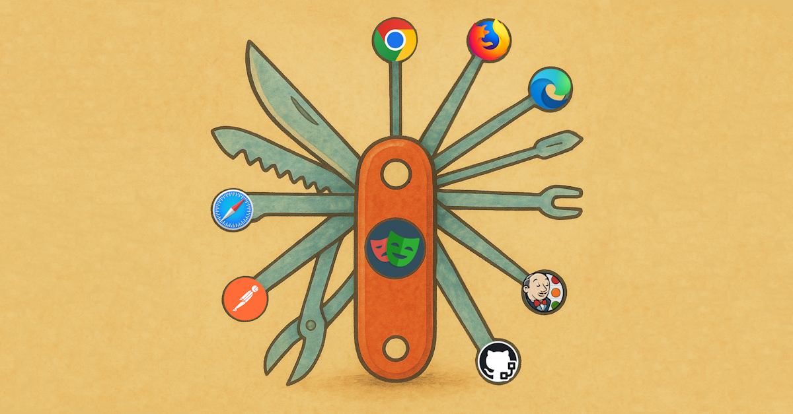

# Test Automation Blog

This blog explores modern software test automation, examining tools, frameworks, and best practices to push the industry forward.

## Articles

### April 2025
- **[Ultimate TA Tool Part 2: Browser Support](./2025-04-20-browser-support.md)** (April 20, 2025)  
  Playwright's built-in browser management vs. Selenium's WebDriver woes, and Cypress's limitations. 
  Discover how Playwright's flexibility and browser API access make it the go-to choice for cross-platform testing.

- **[Ultimate TA Tool Part 1: Language Support](./2025-04-12-language-support.md)** (April 12, 2025)  
  Comparing language support across Selenium, Cypress, and Playwright - which framework gives you the edge for modern web development?

### March 2025
- **[Today's Web Test Automation — Houston, We've Got a Problem](./2025-03-29-todays-web-test-automation.md)** (March 29, 2025)  
  An analysis of the job market's reliance on outdated tools and how it's slowing down technological progress in test automation.

## About This Blog

From tackling Selenium's stagnation to championing Playwright's capabilities, each post dives into practical strategies for effective testing. Expect raw insights, code snippets, and a vision for the future of test automation — contributions and discussions welcome!

[View on GitHub](https://github.com/dvakompota/blog)